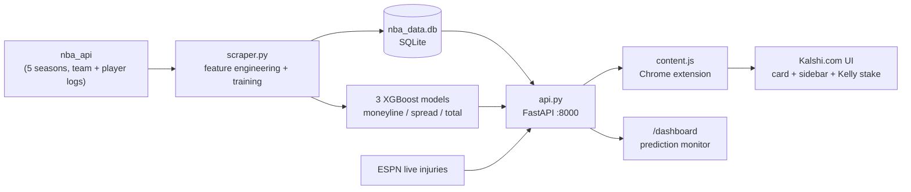
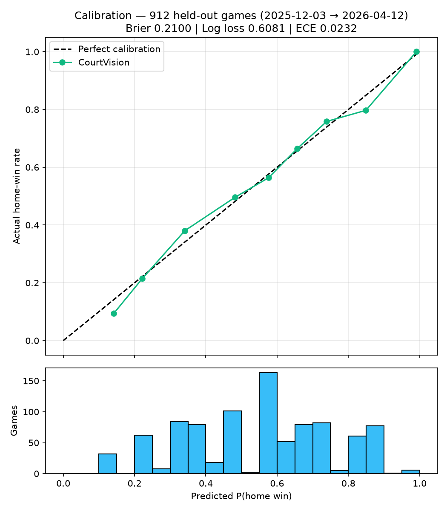

# CourtVision AI 🏀

[](https://github.com/skarne21/CourtVision/actions/workflows/tests.yml)


[](LICENSE)

A full-stack quantitative betting tool that finds Expected Value (+EV) in NBA markets on the Kalshi prediction platform. Five seasons of NBA data feed three calibrated XGBoost models behind a FastAPI server; a Chrome extension overlays the predictions, the edge vs. the live market price, and a Kelly-criterion stake directly onto Kalshi's UI.

**The core thesis:** `edge = AI_probability − market_probability`. Positive edge → bet, negative → skip. That makes probability *calibration* — not raw accuracy — the metric that matters, and the whole pipeline is built around it.

<!-- TODO: demo GIF of the extension on a live Kalshi NBA market (record during season) -->

## Highlights

- **End-to-end system, not a notebook** — data ingestion → feature engineering → training → REST API → browser extension → monitoring dashboard
- **Calibrated probabilities** — isotonic calibration on a chronological hold-out; stated 63% wins ~63% of the time (ECE 0.023)
- **Honest evaluation** — a lookahead-leakage bug in the original train/test split was found, fixed, and the metrics restated *downward*; `backtest.py` reproduces every number on 912 games the models never saw
- **Measured feature engineering** — pace-adjusted efficiency ratings and injury usage share improved held-out log-loss 0.644 → 0.608 (recorded before/after, not assumed)
- **Production hygiene** — pytest suite proving the no-leakage property, GitHub Actions CI, Docker image, parameterized SQL, prediction audit log

## Table of Contents

- [Architecture](#architecture)
- [Model Performance](#model-performance-honest-numbers)
- [What the Extension Does](#what-the-extension-does)
- [Repository Structure](#repository-structure)
- [Quickstart](#quickstart)
- [How the Models Work](#how-the-models-work)
- [Roadmap](#roadmap)
- [License & Disclaimer](#license--disclaimer)

---

## Architecture



---

## Model Performance (honest numbers)

All metrics are computed on a strictly chronological hold-out: **912 games (Dec 2025 → Apr 2026)** that neither the models nor the calibration layer ever saw.

| Metric | Value | Baseline |
|---|---|---|
| Brier score | **0.2100** | 0.25 (random) |
| Log loss | **0.6081** | 0.693 (random) |
| Expected Calibration Error | **0.0232** | 0.00 (perfect) |
| Winner hit rate | **66.7%** | 55.0% (always pick home) |
| Spread MAE | **11.52 pts** | σ = 14.73 |
| Total MAE | **15.65 pts** | σ = 19.59 |



Two things worth calling out, because they were found the hard way:

1. **A leaky split was found and fixed.** The original "chronological" train/test split actually sliced rows sorted by team ID — and since every game appears twice (once per team's perspective), test games leaked into training via their mirrored rows. The re-sort fix made every metric slightly worse and entirely real. Reproduce the evaluation anytime with `python backtest.py`.
2. **Feature engineering was measured, not assumed.** Adding pace-adjusted efficiency ratings (OFF_RTG/DEF_RTG per 100 possessions, own + opponent) and injury usage share (`MISSING_USAGE_PCT`) improved held-out log loss **0.6443 → 0.6081** and cut calibration error **0.0813 → 0.0232** vs. the previous 21-feature model. The new features rank in the top 10 by importance.

---

## What the Extension Does

- Scans Kalshi pages every 3s for NBA matchups (`[City] at [City]`), including React re-renders
- Detects the market type from page text: moneyline, spread ("wins by over X points"), or total ("Over X points scored")
- Calls the local API, extracts the live market price from the DOM, and renders:
  - **AI probability vs. market probability** for both sides
  - **Edge %** with confidence tiers (green >5%, yellow >0%, red ≤0%)
  - **Kelly-criterion stake** — `f* = (p−c)/(1−c)` capped at 25%, from the bankroll set in the extension popup; never recommends betting negative EV
  - **Top-3 SHAP feature contributions** ("Why this pick") via XGBoost's native TreeSHAP
- Main feed pages get a sidebar ranking every visible game by edge

### The edge, in one example

```
Market price:  50¢  →  50% implied probability
CourtVision:        →  65% win probability     →  +15% edge  ✅ bet

Market price:  90¢  →  90% implied probability
CourtVision:        →  85% win probability     →  −5% edge   🔴 skip (even though they'll probably win)
```

---

## Repository Structure

```
CourtVision/
├── Backend/
│   ├── scraper.py          # data pipeline + trains all 3 models
│   ├── api.py              # FastAPI server: /predict, /dashboard, prediction logging
│   ├── features.py         # single source of truth for the 33-feature list
│   ├── backtest.py         # hold-out evaluation + calibration diagram
│   ├── test_pipeline.py    # pytest: lookahead-leakage proof, feature integrity
│   └── live_injuries.py    # ESPN injury report scraper
├── Frontend/
│   ├── manifest.json       # Chrome extension (Manifest V3)
│   ├── content.js          # DOM scanner + card/sidebar injection
│   └── popup.html/js       # bankroll setting for Kelly stakes
├── Dockerfile
└── .github/workflows/tests.yml
```

Model artifacts (`*.joblib`) and `nba_data.db` are gitignored — they are rebuilt by `scraper.py`.

---

## Quickstart

```bash
git clone https://github.com/skarne21/CourtVision && cd CourtVision
python -m venv venv
venv\Scripts\activate            # Windows   (source venv/bin/activate on Mac/Linux)
pip install -r requirements.txt

cd Backend
python scraper.py                # train all 3 models (~10-15 min, NBA API rate limits)
python backtest.py               # verify hold-out metrics + calibration diagram
python -m pytest test_pipeline.py -q
uvicorn api:app --reload         # API at http://127.0.0.1:8000
```

Then load the extension: Chrome → `chrome://extensions` → Developer mode → **Load unpacked** → select `Frontend/` → browse Kalshi NBA markets.

### Docker

```bash
python Backend/scraper.py        # artifacts must exist before building
docker build -t courtvision .
docker run -p 8000:8000 courtvision
```

### API

```
GET /predict?home_team=LAL&away_team=BOS                                        # moneyline
GET /predict?home_team=LAL&away_team=BOS&market_type=spread&line=5.5&spread_team=LAL
GET /predict?home_team=LAL&away_team=BOS&market_type=total&line=224.5
GET /dashboard                                                                  # prediction monitor
```

Every `/predict` call is logged to a `prediction_log` table (pick, probability, market price, timestamp). The `/dashboard` route grades logged predictions against final scores once games resolve — hit rate, average edge at prediction time, and per-pick results.

---

## How the Models Work

**Features (33):** pre-game Elo (own + opponent, K=20, +100 home court), rest days and rest differential, injury impact (`MISSING_PLAYER_VALUE` = rolling PRA of absent rotation players, `MISSING_USAGE_PCT` = that as a share of roster production, both sides), and 5/10-game rolling windows of PTS, PTS allowed, eFG%, +/−, AST, REB, TOV, pace, and offensive/defensive rating per 100 possessions — with the opponent's rolling efficiency ratings merged in so the model sees the matchup, not just one team's form.

**Leakage prevention:** every rolling stat is `.shift(1)` so a game never sees its own box score; windows group by season so October never inherits April; `TimeSeriesSplit` keeps the hyperparameter search causal; the 70/15/15 train/calibration/test split is strictly date-ordered. `test_pipeline.py` proves the shift property on synthetic data in CI.

**Calibration:** XGBoost's raw `predict_proba` is systematically overconfident — "70%" historically wins ~62% of the time, which silently fabricates edge. An isotonic layer (`CalibratedClassifierCV` via `PredefinedSplit`) is fitted on the middle 15% slice, so a stated 63% resolves as a win ~63% of the time. This is why evaluation uses Brier/log-loss/ECE, never accuracy: a coin that always says "home 51%" gets decent accuracy and loses money.

**Spread & totals:** two `XGBRegressor`s predict home margin and combined points; the residual σ on held-out games turns a point estimate into a cover/over probability via `P = 1 − Φ((line − μ)/σ)`.

---

## Roadmap

| Phase | Description | Status |
|---|---|---|
| Data pipeline, Elo, injury features | | ✅ |
| Calibrated moneyline model + betting-grade eval | | ✅ |
| Spread & total regressors | | ✅ |
| Chrome extension: card, sidebar, edge, Kelly, SHAP | | ✅ |
| Prediction logging + backtest harness | | ✅ |
| Tests + CI, Docker | | ✅ |
| Pace/efficiency + usage-share features (measured: LL 0.644→0.608) | | ✅ |
| `/dashboard` prediction monitor | | ✅ |
| Web dashboard: live Kalshi markets + account fills vs. logged predictions (official Kalshi API) | | Planned |

---

## License & Disclaimer

[MIT](LICENSE). Educational project. Not financial advice. NBA outcomes are ~65–70% predictable at best; a calibrated model tells you when the market is mispriced, not who will win. Bet responsibly or not at all.
